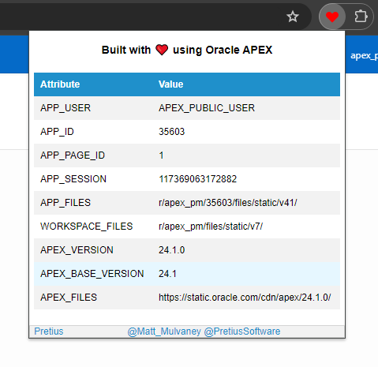
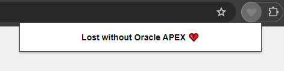

# Built with ❤️ using Oracle APEX

## Overview
**Built with ❤️ using Oracle APEX** is a Chrome extension that displays a red heart and additional information on webpages built with Oracle APEX. 

For pages not using Oracle APEX, it displays a heartbroken message.

## Features
- Detects if a webpage is built with Oracle APEX.
- Displays a red heart and information on Oracle APEX pages including the APEX version
- Shows a heartbroken emoji with a randomised sad message for non-Oracle APEX pages.

## Screenshots

## Installation
1. **Install from Chrome Web Store**:
   - Visit the [Chrome Web Store](https://chromewebstore.google.com/detail/built-with-love-using-ora/bhlkijnameeejlifhlmhcfjgmigdpjae) and click on "Add to Chrome".
   
2. **Pin to Taskbar**:
   - After installation, right-click on the extension icon in the Chrome toolbar.
   - Select "Pin" to keep it handy in your taskbar.

## Usage
1. Navigate to any webpage.
2. The extension icon will change based on whether the page is built with Oracle APEX:
   - Red heart icon for Oracle APEX pages.
   - Grey heart icon for non-Oracle APEX pages.
3. Click on the extension icon to see additional information on APEX pages

## Test it out 
- [Cards](https://apex.oracle.com/go/sample_cards)

- [Charts](https://apex.oracle.com/go/sample_charts)

- [Maps](https://apex.oracle.com/go/sample_maps)

- [PWA (Progressive Web App)](https://apex.oracle.com/go/pwa)

- [Universal Theme](https://apex.oracle.com/ut)

# Release History

24.1.1 : July 2024
* Initial Version

## Built with ❤️ using Oracle APEX

- Author: [Matt Mulvaney](https://x.com/Matt_Mulvaney)

- Low-Code: [Pretius](https://x.com/PretiusSoftware)